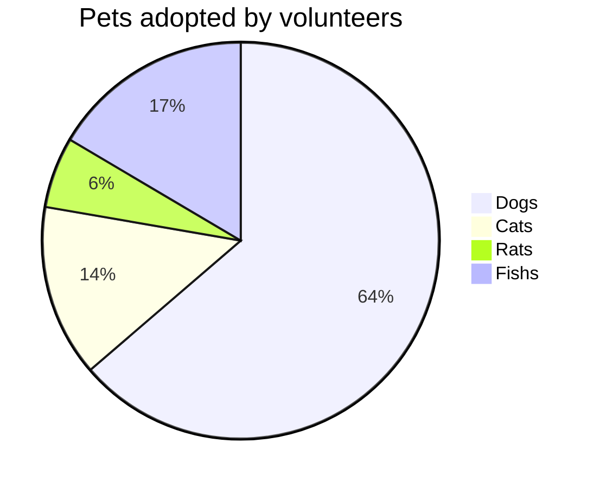

测试一些乱七八糟的使用  
does it works?

It looks like you just forgot to include  from random
import random  at the top of your file.

> info "the head"
> xxxx  
> xxxxx
  
## 测试  

> info "Linked"
> This is a [reference link][example].

 > citation "-- Mark Twain" [ cite = "twain" ]
 > Lorem ipsum dolor sit amet, consectetur adipiscing elit. Aenean interdum, ligula in
 > ultrices sodales, ante enim scelerisque diam, nec molestie lorem nulla sit amet dolor.
 > Aenean id augue ante. Duis ut mi faucibus, pellentesque sem quis, gravida nisi. Nam cursus.

---

> note "My note"
> Lorem ipsum dolor sit amet, consectetur adipiscing elit. Aenean interdum, ligula in
> ultrices sodales, ante enim scelerisque diam, nec molestie lorem nulla sit amet dolor.
> Aenean id augue ante. Duis ut mi faucibus, pellentesque sem quis, gravida nisi. Nam cursus.

---

 > error "The information header"
 > [Premonition](https://github.com/lazee/premonition) allows you to add
 >
 > * Lists
 > * like this
 >
 > Use *formatting* and add code blocks.
 >
 > ~~~~
 > Isn't that sweet?
 > ~~~~~
 > Anything you can do in Markdown, you can do here. Expect from embeds Premonition boxes ;)

> foo "Linked"
> Unknown type  

---

<div class="fa-3x">
  <i class="fas fa-spinner fa-spin"></i>
  <i class="fas fa-circle-notch fa-spin"></i>
  <i class="fas fa-sync fa-spin"></i>
  <i class="fas fa-cog fa-spin"></i>
  <i class="fas fa-spinner fa-pulse"></i>
  <i class="fas fa-stroopwafel fa-spin"></i>
</div>

Move to HTML please.

*[HTML]: Hyper Text Markup Language

paragraph1
{: style="color:#bfa"}

```xml

``` 


```sql
select 1+1=2;
```

