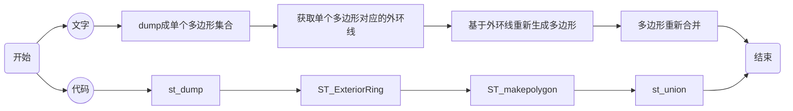

## 查看postgis版本

```sql
select postgis_version() ;
--or
select postgis_full_version() ;
```

  

## 對象操作

|功能|函數|說明|示例|
|-|-|-|-|
|圖形縮放|[ST_TransScale(geometry geomA, float deltaX, float deltaY, float XFactor, float YFactor)](http://postgis.net/docs/manual-3.0/ST_TransScale.html)|將圖形縮放(XFactor,YFactor)倍,基於(deltaX,deltaY)| select spolygon,ST_TransScale(spolygon,longitude,latitude,0.5,0.5)as geom from tablexxx <br />|
|外環線|[ST_ExteriorRing(geometry a_polygon)](http://postgis.net/docs/manual-3.0/ST_ExteriorRing.html)|基于多边形(a polygon)获取外边边界的线| select ST_ExteriorRing(geom) from cfg_city_info where city='xxx' <br />  





## 消除多边形内部孔洞(支持multipolygon)

  

解决思路


